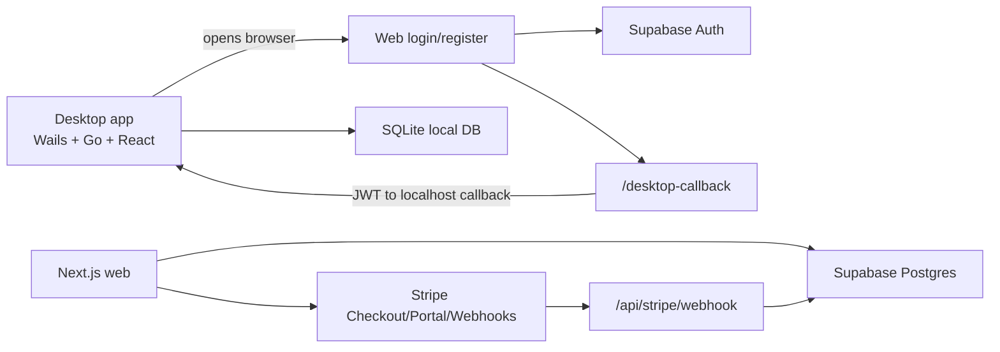

# System Overview

## Назначение

`AdOps Cockpit` помогает медиабаеру централизованно вести рекламные кабинеты, группировать их в пулы, проверять готовность к запуску, хранить креативы и создавать mock launch jobs.

## Главная схема

## Компоненты

- [[04 Desktop App|Desktop app]] - основной рабочий интерфейс: кабинеты, пулы, health checks, креативы, автозалив.
- [[05 Web Resource|Web resource]] - авторизация, регистрация, аккаунт, подписки.
- [[06 Auth Flow|Auth flow]] - desktop запускает локальный callback server, web возвращает JWT.
- [[07 Billing and Subscriptions|Billing]] - Stripe checkout и план аккаунта.
- [[08 Database and Data Model|Database]] - Supabase Postgres для web identity/subscriptions, SQLite для desktop рабочих данных.

## Ключевое архитектурное решение

Аккаунт и подписка живут на web-стороне. Desktop не активируется license key, а применяет статус аккаунта после входа. Это снижает ручное управление ключами и делает подписку единственным источником прав.

## Сейчас реализовано

- Web login/register через Supabase Auth.
- Desktop browser auth flow.
- `session.json` в `%APPDATA%\AdOpsCockpit`.
- JWT verification через `/api/session/verify`.
- Stripe routes для checkout, billing portal и webhook.
- Основной desktop функционал продолжает работать локально через SQLite.

