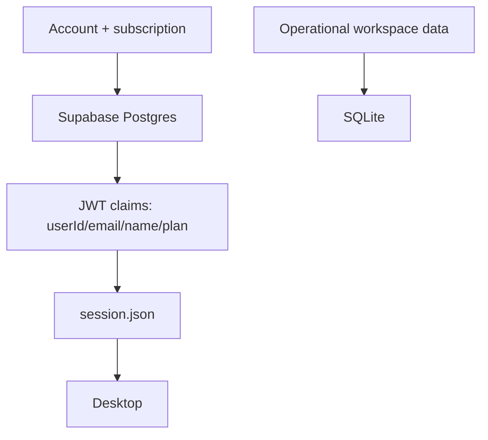

# Architecture Map

## Репозиторий

```text
.
├─ src/                  # Next.js web app
├─ adops-desktop/        # Wails desktop app
├─ prisma/               # Prisma schema and seed
├─ supabase/migrations/  # Supabase SQL migrations
├─ obsidian-vault/       # Knowledge base
```

## Web stack

- Next.js 14 App Router.
- React + TypeScript.
- Tailwind CSS.
- Prisma.
- Supabase Auth.
- Supabase Postgres.
- Stripe.

## Desktop stack

- Wails v2.
- Go backend.
- React/Vite frontend.
- GORM.
- SQLite local database.

## Data boundary



## Важные границы

- Web не является основным рабочим cockpit.
- Desktop не должен снова вводить license key.
- Stripe webhook обновляет план в `User`.
- Desktop получает план из JWT/session.

## Риски архитектуры

- Web и desktop имеют похожие доменные модели, но разные БД.
- Если desktop данные нужно будет синхронизировать между устройствами, текущая SQLite-граница потребует отдельной sync-архитектуры.
- Подписка сейчас применяется при входе/обновлении session, а не realtime.

