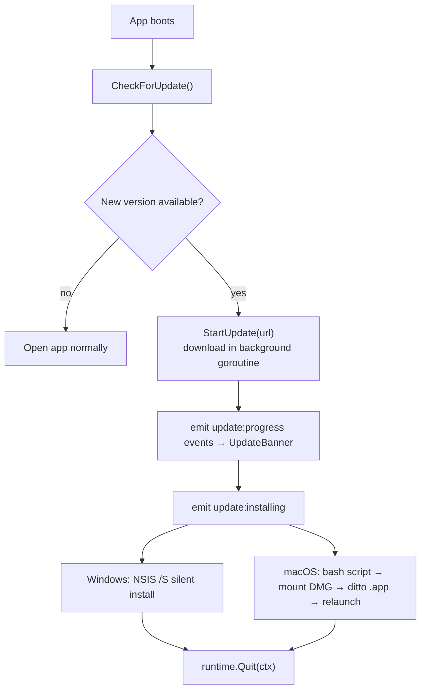

# Desktop App

## Роль

Desktop app - основное приложение с рабочим функционалом. Пользователь проводит здесь ежедневные операции: аккаунты, пулы, креативы, health checks, launch jobs.

## Технологии

- Wails/Go backend.
- React/Vite frontend.
- SQLite через GORM.
- Local session file `session.json`.

## Ключевые файлы

- `adops-desktop/app.go`
- `adops-desktop/internal/db/models.go`
- `adops-desktop/internal/session/session.go`
- `adops-desktop/internal/authflow/authflow.go`
- `adops-desktop/internal/updater/updater.go`
- `adops-desktop/internal/updater/install.go`
- `adops-desktop/frontend/src/App.tsx`
- `adops-desktop/frontend/src/pages/*`

## Auth behavior

Desktop больше не регистрирует и не логинит пользователя локально. Он:

1. читает `%APPDATA%\AdOpsCockpit\session.json`;
2. проверяет JWT через web `/api/session/verify`;
3. если сессии нет - показывает экран входа;
4. при клике запускает локальный HTTP callback server;
5. открывает web `/login?callback=...&state=...`;
6. получает JWT от web через hidden iframe (Chrome PNA fix);
7. сохраняет session и открывает основной интерфейс.

## Auto-update

При каждом запуске desktop проверяет новую версию через `GET /api/version` на web-сервере.

### Механизм



### Go backend

- `app.go`: `GetVersion() string`, `StartUpdate(url string)` — запускает горутину, эмитирует события через `runtime.EventsEmit`.
- `internal/updater/updater.go`: `Check()` — запрашивает `/api/version`, сравнивает с `Version`, возвращает URL для текущей платформы.
- `internal/updater/install.go`: `Install(url, onProgress, onInstalling)` — скачивает во временный файл, вызывает платформенный инсталлятор.

### Frontend

- `App.tsx`: `EventsOn("update:progress"|"update:installing"|"update:error", ...)` — слушает события.
- `App.tsx`: `UpdateBanner` component — анимированный прогресс-бар с shimmer-эффектом.
- `globals.css`: `@keyframes shimmer`, `@keyframes indeterminate`.

### Vercel download proxy

Релизные ассеты хранятся в private GitHub repo. Прямые ссылки на ассеты требуют auth. Решение: Vercel proxy `/api/download/[platform]`:

1. Получает pre-signed CDN URL от GitHub API с `GITHUB_RELEASES_TOKEN`.
2. Возвращает `302 redirect` на CDN URL.
3. Desktop делает запрос на `/api/download/windows` (или `macos-arm`, `macos-intel`) и следует за 302.

### Версия в UI

Версия отображается в sidebar рядом с названием приложения: маленький текст `v1.0.X`.

## Version manifest

`GET https://ad-ops-cockpit.vercel.app/api/version` возвращает:

```json
{
  "version": "v1.0.15",
  "windowsUrl": "https://ad-ops-cockpit.vercel.app/api/download/windows",
  "macosArmUrl": "https://ad-ops-cockpit.vercel.app/api/download/macos-arm",
  "macosIntelUrl": "https://ad-ops-cockpit.vercel.app/api/download/macos-intel"
}
```

## Local database

SQLite хранит рабочие данные:

- accounts;
- pools;
- health checks;
- creatives (+ поле `Angle`);
- templates (+ поля `CampaignNameTpl`, `Vertical`);
- headline sets;
- launch jobs (+ `GetLaunchJobsDetailed` с Preload);
- audit logs.

## Launch UX (redesigned)

### Вертикальные пресеты

`lib/presets.ts` содержит 5 вертикалей (NUTRA/GAMBLING/CRYPTO/DATING/ECOM), применяются кликом на pills в Step 2. Автоматически заполняют objective, bidStrategy, optimizationGoal, dailyBudget.

### Naming presets

5 пресетов нейминга (Минимальный/Стандартный/Полный/Нутра/Custom). Переменные: `{account}`, `{vertical}`, `{geo}`, `{date}`, `{creative}`, `{angle}`, `{zGroup}`, `{num}`, `{structure}`. Custom-режим включается при ручном редактировании полей.

### Анимации

`globals.css` содержит 5 keyframe анимаций: `fadeInUp`, `slideInFromRight`, `slideInFromLeft`, `scaleIn`, `countPop`. Шаги wizard переключаются с направленной анимацией (forward/back).

### Creative Angles

10 типов углов: BeforeAfter, Doctor, Testimonial, WinScene, NewsStyle, NativePromo, ShockHook, Tutorial, UGC, ProductDemo. Сохраняются в `Creative.Angle`, отображаются в карточках и в форме добавления.

### История залива (`launch-history`)

Новая страница с агрегированной статистикой (всего запусков, средний % успеха, всего кабинетов), фильтрацией по статусу/структуре, expandable rows с детализацией по кабинетам. Кнопка Re-launch диспатчит `CustomEvent("navigate", {detail:"launch"})`.

### Navigation event

`App.tsx` слушает `window.dispatchEvent(new CustomEvent("navigate", {detail: "page-name"}))` — позволяет дочерним компонентам (LaunchClient, LaunchHistoryClient) менять страницу без prop drilling.

## Что больше не должно развиваться

- License key activation как основной способ доступа.
- Локальный bcrypt login/register.

Эти части можно удалить позже отдельной миграцией, когда будет подтверждено, что старые локальные данные не требуют переноса.
