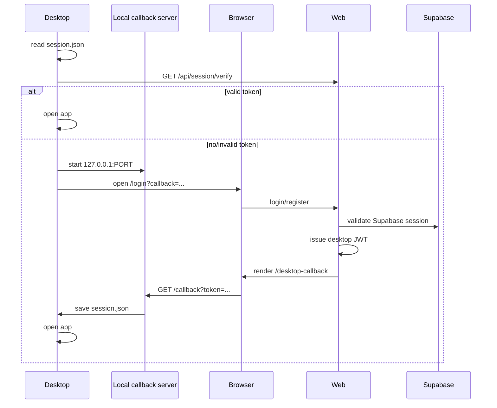

# Auth Flow

## Цель

Desktop должен авторизоваться через web-аккаунт, чтобы подписка применялась по аккаунту, а не через локальный ключ.

## Sequence



## session.json

```json
{
  "token": "eyJ...",
  "userId": "uuid",
  "email": "user@example.com",
  "name": "Alex",
  "plan": "pro",
  "expiresAt": "2026-07-01T00:00:00Z"
}
```

## Security details

- Callback URL должен быть только `localhost` или `127.0.0.1`.
- `state` нужен для защиты от случайного callback.
- JWT подписывается `JWT_SECRET`.
- Desktop проверяет сохраненный token через `/api/session/verify`.

## UX decision

Страница `/desktop-callback` показывает:

- имя;
- email;
- тариф;
- срок действия;
- кнопку возврата в приложение;
- кнопку оплаты/продления.

Страница также автоматически уведомляет desktop локальным callback-запросом.

