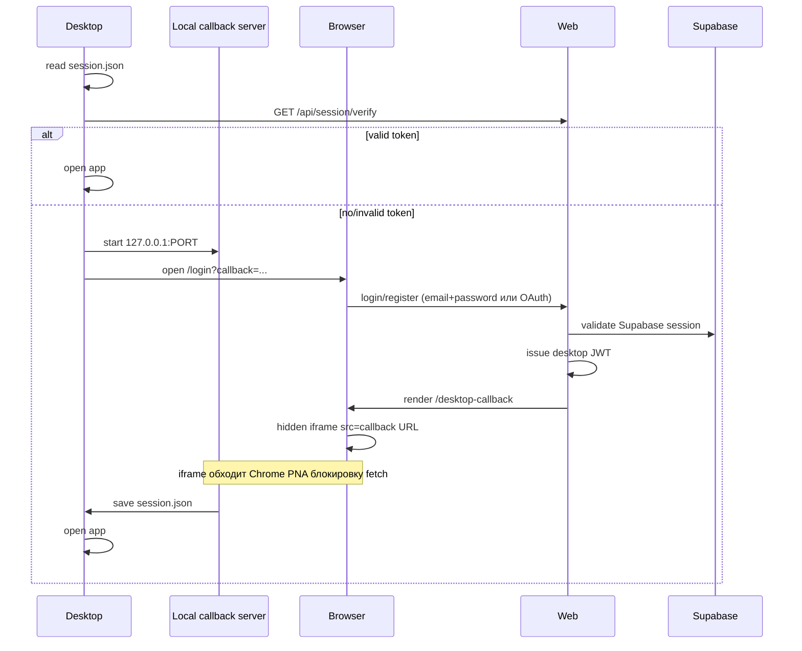

# Auth Flow

## Цель

Desktop должен авторизоваться через web-аккаунт, чтобы подписка применялась по аккаунту, а не через локальный ключ.

## Sequence



## session.json

```json
{
  "token": "eyJ...",
  "userId": "uuid",
  "email": "user@example.com",
  "name": "Alex",
  "plan": "pro",
  "expiresAt": "2026-07-01T00:00:00Z"
}
```

## Security details

- Callback URL должен быть только `localhost` или `127.0.0.1`.
- `state` нужен для защиты от случайного callback.
- JWT подписывается `JWT_SECRET`.
- Desktop проверяет сохраненный token через `/api/session/verify`.

## Chrome PNA fix

`fetch()` из HTTPS-страницы (`vercel.app`) к `http://127.0.0.1` заблокирован Chrome Private Network Access policy.

**Решение**: `RedirectClient.tsx` рендерит скрытый `<iframe src={callbackUrl}>` вместо `window.location.replace` или `fetch`.

Go callback server отвечает на OPTIONS preflight с заголовком:
```
Access-Control-Allow-Private-Network: true
```

Это разрешает iframe-навигацию с HTTPS на localhost.

## OAuth (Google / Apple)

- Суpabase OAuth с `prompt: "select_account"` — принудительный выбор аккаунта Google при каждом входе (не автологин сохранённой сессией).
- `redirectTo` должен быть добавлен в Redirect URLs в Supabase Dashboard (wildcard `*` для query params): `https://ad-ops-cockpit.vercel.app/api/auth/callback*`.
- Callback route `/api/auth/callback` передаёт `desktop_callback` и `desktop_state` в `/desktop-callback`.

## UX decision

Страница `/desktop-callback` показывает:

- имя;
- email;
- тариф;
- срок действия;
- кнопку `Открыть приложение вручную` (fallback, если iframe не сработал);
- кнопку оплаты/продления.

Страница автоматически уведомляет desktop через hidden iframe, а не `window.location.replace`, чтобы браузер остался на Vercel-странице.
