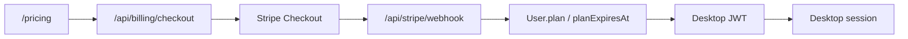

# Billing and Subscriptions

## Цель

Подписка должна применяться по web-аккаунту. Пользователь платит на web, а desktop получает тариф после входа.

## Текущие планы

- `free`
- `pro`
- `team`

## Stripe flow



## Ключевые env

```env
STRIPE_SECRET_KEY=sk_test_...
STRIPE_WEBHOOK_SECRET=whsec_...
STRIPE_PRO_PRICE_ID=price_...
STRIPE_TEAM_PRICE_ID=price_...
NEXT_PUBLIC_APP_URL=http://localhost:3000
```

## Где хранится подписка

В Prisma model `User`:

- `plan`
- `planExpiresAt`
- `stripeCustomerId`

## Что важно помнить

- Checkout сам по себе не должен быть единственным источником истины.
- Финальное обновление плана делает Stripe webhook.
- Desktop видит новый plan после обновления сессии или повторного входа.
- Для полноценного enforcement нужно отдельно ограничить функции desktop по `plan`.

## Следующий шаг

Добавить `Entitlements` слой:

- лимиты кабинетов;
- лимиты launch jobs;
- доступ к integrations;
- retention audit logs;
- ограничения по team features.

