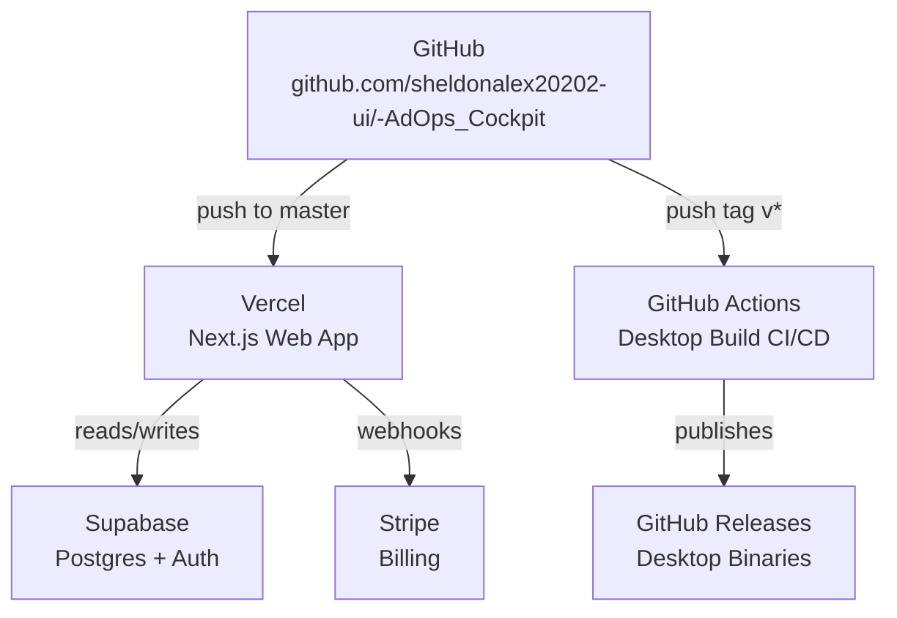

# Infrastructure

Описание всей развёрнутой инфраструктуры AdOps Cockpit: где что хостится, по каким адресам доступно, как деплоится.

## Обзор



---

## Компоненты

### Web App — Vercel

| | |
|---|---|
| **Платформа** | Vercel Hobby (free) |
| **URL (preview)** | https://ad-ops-cockpit-2rxv82q03-sheldonalex20202-uis-projects.vercel.app |
| **Production URL** | _(настроить custom domain)_ |
| **Репозиторий** | https://github.com/sheldonalex20202-ui/-AdOps_Cockpit |
| **Branch** | `master` → auto-deploy |
| **Framework** | Next.js 14 App Router |
| **Build** | `next build` (дефолт) |
| **Deploy trigger** | Каждый `git push origin master` |

**Что живёт здесь:**
- Авторизация (email/password, Google, Apple)
- Регистрация аккаунта
- Биллинг и подписки (Stripe)
- Desktop auth callback (`/desktop-callback`)
- REST API для десктопного приложения

---

### Database & Auth — Supabase

| | |
|---|---|
| **Платформа** | Supabase Free Tier |
| **Auth providers** | Email/Password · Google OAuth · Apple OAuth |
| **Database** | PostgreSQL (500 MB free) |
| **Connection (pooler)** | `DATABASE_URL` — Transaction mode, порт 6543 |
| **Connection (direct)** | `DIRECT_URL` — Session mode, порт 5432 |

**Что живёт здесь:**
- `User` — аккаунты, план, Stripe customer ID
- Supabase Auth — сессии, JWT
- RLS политики для всех таблиц

---

### Source Code & CI/CD — GitHub

| | |
|---|---|
| **Репозиторий** | https://github.com/sheldonalex20202-ui/-AdOps_Cockpit |
| **Видимость** | Private |
| **Default branch** | `master` |

**Workflows:**

| Файл | Триггер | Что делает |
|------|---------|-----------|
| `.github/workflows/web-deploy.yml` | Push/PR в `master` | TypeScript typecheck |
| `.github/workflows/desktop-release.yml` | Push тега `v*` | Собирает Windows + macOS, публикует GitHub Release |

---

### Desktop App Distribution — GitHub Releases

| | |
|---|---|
| **Платформа** | GitHub Releases (free, unlimited) |
| **Releases URL** | https://github.com/sheldonalex20202-ui/-AdOps_Cockpit/releases |
| **Windows** | `.exe` NSIS installer (`windows/amd64`) |
| **macOS Intel** | `.dmg` (`darwin/amd64`) |
| **macOS Apple Silicon** | `.dmg` (`darwin/arm64`) |

**Как выпустить новую версию:**
```bash
git tag v1.0.0
git push origin v1.0.0
# GitHub Actions автоматически собирает бинарники и создаёт Release
```

---

### Billing — Stripe

| | |
|---|---|
| **Платформа** | Stripe |
| **Webhook endpoint** | `https://<production-domain>/api/stripe/webhook` |
| **Checkout** | `/api/billing/checkout` |
| **Portal** | `/api/billing/portal` |

---

## Переменные окружения

Все переменные задокументированы в `.env.example` в корне репозитория.

| Переменная | Где используется |
|-----------|-----------------|
| `NEXT_PUBLIC_SUPABASE_URL` | Vercel + browser |
| `NEXT_PUBLIC_SUPABASE_ANON_KEY` | Vercel + browser |
| `SUPABASE_SERVICE_ROLE_KEY` | Vercel server-only |
| `DATABASE_URL` | Prisma (pooler, serverless) |
| `DIRECT_URL` | Prisma (direct, migrations) |
| `JWT_SECRET` | Desktop token signing |
| `ENCRYPTION_KEY` | Token encryption |
| `NEXT_PUBLIC_APP_URL` | Stripe redirects, callbacks |
| `STRIPE_SECRET_KEY` | Stripe API |
| `STRIPE_WEBHOOK_SECRET` | Stripe webhook verification |

---

## Что сделать после MVP

- [ ] Настроить custom domain на Vercel
- [ ] Обновить `NEXT_PUBLIC_APP_URL` на production domain
- [ ] Обновить Stripe webhook endpoint на production URL
- [ ] Обновить Supabase Auth → URL Configuration → Site URL на production domain
- [ ] Обновить Supabase Auth → Redirect URLs на production callback
- [ ] Включить Google и Apple OAuth провайдеры в Supabase Dashboard
- [ ] Настроить реальные Stripe products/prices
