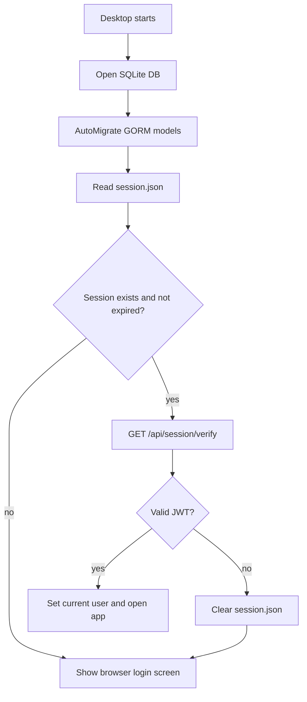

# Desktop Startup Process

## Цель

При запуске desktop-приложение должно понять, можно ли открыть основной интерфейс или нужно отправить пользователя на web-авторизацию.

## Участники

- Wails app backend.
- Local SQLite database.
- `session.json`.
- Web API `/api/session/verify`.
- React desktop frontend.

## Триггер

Пользователь запускает `adops-desktop.exe` или `wails dev`.

## Flow

## Данные чтения

- `%APPDATA%\AdOpsCockpit\session.json`
- `ADOPS_WEB_URL`
- local SQLite DB.

## Данные записи

- SQLite migrations through GORM AutoMigrate.
- Potential clearing of invalid `session.json`.

## Файлы реализации

- `adops-desktop/app.go`
- `adops-desktop/internal/db/db.go`
- `adops-desktop/internal/session/session.go`
- `adops-desktop/frontend/src/App.tsx`

## Edge cases

- Web server недоступен.
- `session.json` поврежден.
- JWT истек.
- JWT подписан старым `JWT_SECRET`.
- Desktop запущен на production, но `ADOPS_WEB_URL` не задан и указывает на localhost.

## Текущая UX-реакция

Если пользователь не авторизован, desktop показывает экран с кнопкой входа через браузер.

## Улучшения

- Добавить понятное сообщение, если web недоступен.
- Добавить кнопку `Повторить проверку сессии`.
- Добавить refresh session без logout.

