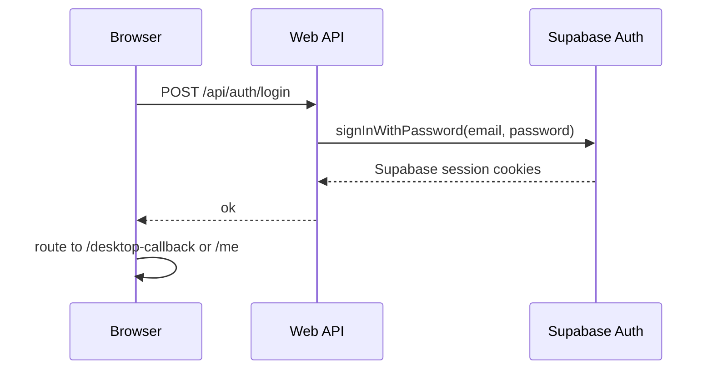
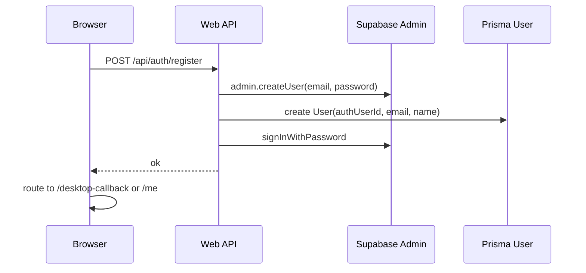

# Web Login and Registration Process

## Цель

Создать или подтвердить web-аккаунт пользователя через Supabase Auth и связать его с `User` в Prisma.

## Участники

- Browser.
- Next.js pages `/login`, `/register`.
- API routes `/api/auth/login`, `/api/auth/register`.
- Supabase Auth.
- Prisma `User`.
- Desktop callback params `callback`, `state`.

## Login flow

## Registration flow

## Данные чтения

- Email/password from user input.
- Optional `callback` and `state` query params.

## Данные записи

- Supabase Auth user.
- Prisma `User`.
- Supabase auth cookies.

## Файлы реализации

- `src/app/login/page.tsx`
- `src/app/register/page.tsx`
- `src/app/api/auth/login/route.ts`
- `src/app/api/auth/register/route.ts`
- `src/lib/supabase/server.ts`
- `src/lib/validators.ts`

## Edge cases

- Supabase user created, but Prisma `User` creation failed.
- Email already exists.
- Password policy mismatch between UI and Zod schema.
- Callback params lost during login/register navigation.

## Улучшения

- Make registration transactional by cleaning up Supabase user if Prisma create fails.
- Add better error mapping for Supabase errors.
- Add email verification flow for production.

