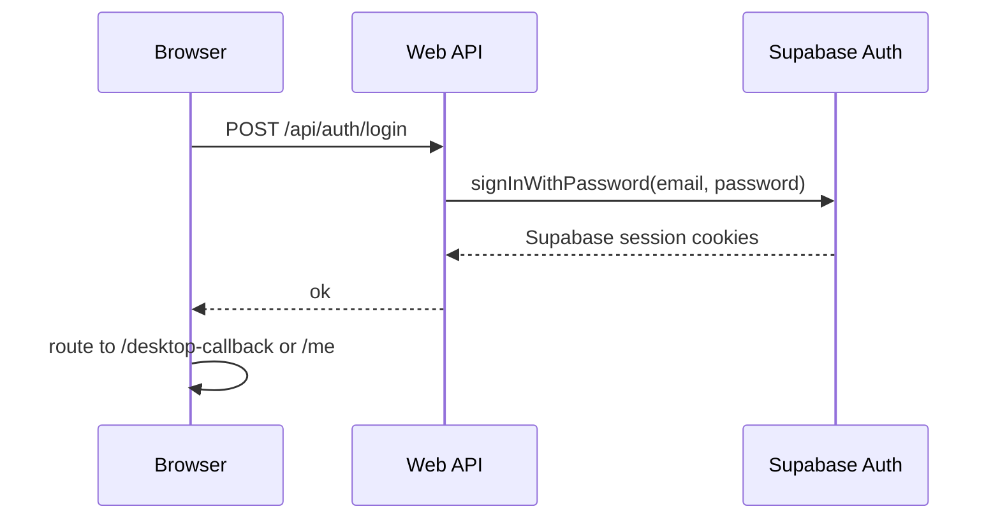
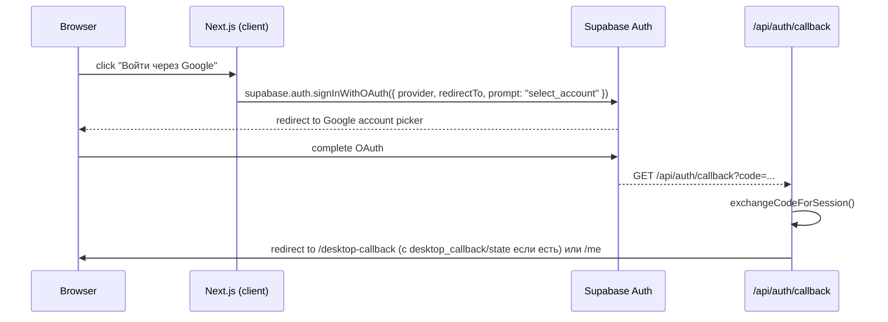
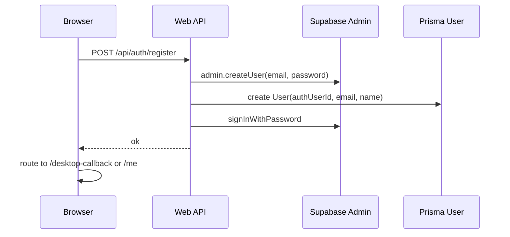

# Web Login and Registration Process

## Цель

Создать или подтвердить web-аккаунт пользователя через Supabase Auth и связать его с `User` в Prisma.

## Участники

- Browser.
- Next.js pages `/login`, `/register`.
- API routes `/api/auth/login`, `/api/auth/register`, `/api/auth/callback`.
- Supabase Auth.
- Prisma `User`.
- Desktop callback params `callback`, `state`.

## Email+password login flow

## OAuth login flow (Google / Apple)

**Важно**: `prompt: "select_account"` принудительно показывает выбор аккаунта Google даже если браузер уже залогинен.

## Registration flow

## Данные чтения

- Email/password from user input.
- Optional `callback` и `state` query params.

## Данные записи

- Supabase Auth user.
- Prisma `User`.
- Supabase auth cookies.

## Файлы реализации

- `src/app/login/page.tsx`
- `src/app/register/page.tsx`
- `src/app/api/auth/login/route.ts`
- `src/app/api/auth/register/route.ts`
- `src/app/api/auth/callback/route.ts`
- `src/lib/supabase/browser.ts`
- `src/lib/supabase/server.ts`
- `src/lib/validators.ts`

## Supabase configuration

Для OAuth redirect нужно в Supabase Dashboard → Authentication → URL Configuration:
- Добавить Redirect URL: `https://ad-ops-cockpit.vercel.app/api/auth/callback*`
- Wildcard `*` нужен, чтобы URL с query params (`?desktop_callback=...`) тоже попадал в allowlist.

## Edge cases

- Supabase user created, но Prisma `User` creation failed.
- Email already exists.
- Password policy mismatch между UI и Zod schema.
- Callback params потерялись при login/register навигации.
- OAuth redirect URL не в allowlist → Supabase redirect идёт на Site URL.
- Пользователь уже залогинен в Google → без `prompt: select_account` входит без выбора аккаунта.

## Улучшения

- Make registration transactional: очищать Supabase user если Prisma create fails.
- Add better error mapping for Supabase errors.
- Add email verification flow for production.
