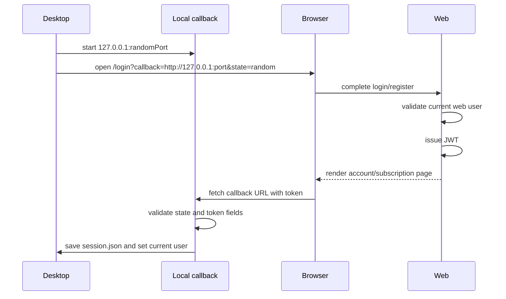

# Desktop Auth Callback Process

## Цель

Передать desktop-приложению web-issued JWT после успешной авторизации в браузере.

## Участники

- Desktop local authflow server.
- Browser.
- Web `/desktop-callback`.
- JWT helper.
- `session.json`.

## Flow

## Данные в callback

- `token`
- `userId`
- `email`
- `name`
- `plan`
- `expiresAt`
- `state`

## Файлы реализации

- `adops-desktop/internal/authflow/authflow.go`
- `adops-desktop/internal/session/session.go`
- `src/app/desktop-callback/page.tsx`
- `src/app/desktop-callback/RedirectClient.tsx`
- `src/lib/jwt.ts`

## Security constraints

- Callback URL только localhost/127.0.0.1.
- `state` должен совпасть.
- JWT подписывается web `JWT_SECRET`.
- Desktop не принимает пароль.

## UX

Страница web callback показывает:

- имя;
- email;
- тариф;
- кнопку возврата в приложение;
- кнопку оплаты или продления.

Она также автоматически делает request на local callback, чтобы desktop не зависал в состоянии ожидания.

## Edge cases

- Browser блокирует запрос на localhost.
- Пользователь закрыл страницу до callback.
- Local callback server истек или был закрыт.
- Пользователь нажал оплату вместо возврата в приложение.

## Улучшения

- Добавить polling fallback: desktop может проверять session file или state endpoint.
- Добавить явный текст ошибки, если callback не дошел.
- Добавить кнопку `Повторить отправку в приложение`.

