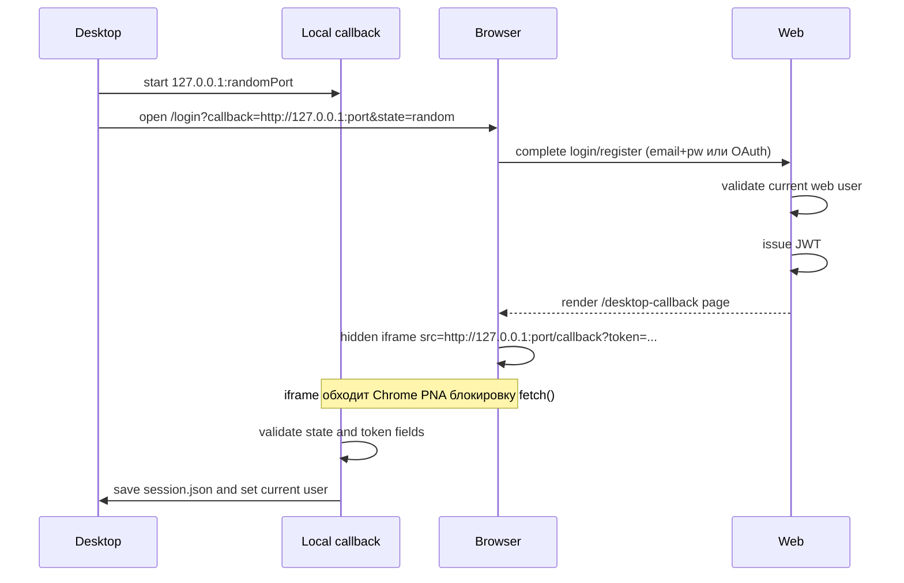

# Desktop Auth Callback Process

## Цель

Передать desktop-приложению web-issued JWT после успешной авторизации в браузере.

## Участники

- Desktop local authflow server.
- Browser.
- Web `/desktop-callback`.
- JWT helper.
- `session.json`.

## Flow



## Chrome PNA (Private Network Access)

`fetch()` из HTTPS (`vercel.app`) на `http://127.0.0.1` блокируется Chrome с ошибкой PNA.

**Реализовано**: `RedirectClient.tsx` использует `<iframe src={redirectUrl}>` (скрытый, `display:none`).

Go callback server отвечает на OPTIONS preflight:
```
Access-Control-Allow-Private-Network: true
Access-Control-Allow-Origin: *
```

Это разрешает iframe навигацию с HTTPS на localhost. `window.location.replace` использовать нельзя — уводит браузер с Vercel-страницы на localhost.

## OAuth (Google/Apple)

- `signInWithOAuth` вызывается с `queryParams: { prompt: "select_account" }` — принудительный выбор аккаунта при каждом входе.
- `redirectTo` передаёт `desktop_callback` и `desktop_state` в callback URL.
- Supabase Dashboard → Authentication → URL Configuration: нужен Redirect URL `https://ad-ops-cockpit.vercel.app/api/auth/callback*`.

## Данные в callback

- `token`
- `userId`
- `email`
- `name`
- `plan`
- `expiresAt`
- `state`

## Файлы реализации

- `adops-desktop/internal/authflow/authflow.go`
- `adops-desktop/internal/session/session.go`
- `src/app/desktop-callback/page.tsx`
- `src/app/desktop-callback/RedirectClient.tsx`
- `src/app/login/page.tsx`
- `src/app/api/auth/callback/route.ts`
- `src/lib/jwt.ts`

## Security constraints

- Callback URL только localhost/127.0.0.1.
- `state` должен совпасть.
- JWT подписывается web `JWT_SECRET`.
- Desktop не принимает пароль.

## UX

Страница web callback показывает:

- имя;
- email;
- тариф;
- кнопку `Открыть приложение вручную` (manual fallback);
- кнопку оплаты или продления.

Она автоматически доставляет token через hidden iframe. Кнопка "Открыть вручную" — fallback для случаев, когда iframe заблокирован или не сработал.

## Edge cases

- Browser блокирует iframe к localhost (редко, но возможно).
- Пользователь закрыл страницу до callback.
- Local callback server истек или был закрыт.
- Пользователь нажал оплату вместо возврата в приложение.
- OAuth redirect URL не добавлен в Supabase allowlist → redirect идёт на Site URL.

## Улучшения

- Добавить polling fallback: desktop может проверять session file или state endpoint.
- Добавить явный текст ошибки, если callback не дошел.
