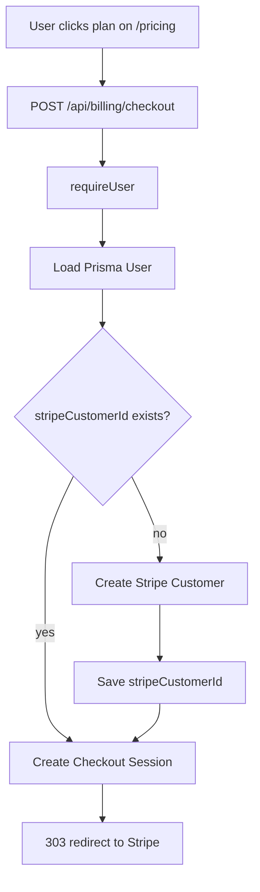

# Subscription Checkout Process

## Цель

Пользователь выбирает план на web и переходит в Stripe Checkout. Подписка привязывается к web-аккаунту.

## Участники

- `/pricing`.
- `/api/billing/checkout`.
- Prisma `User`.
- Stripe Customer.
- Stripe Checkout Session.

## Flow

## Данные чтения

- current web user session;
- form field `plan`;
- form field `returnTo`;
- env price id.

## Данные записи

- `User.stripeCustomerId`, если customer создается впервые.
- Stripe Checkout Session.

## Файлы реализации

- `src/app/pricing/page.tsx`
- `src/app/api/billing/checkout/route.ts`
- `src/lib/billing.ts`

## Validation

`plan` должен быть одним из:

- `pro`
- `team`

`returnTo` должен начинаться с `/`, иначе заменяется на `/me`.

## Edge cases

- Не задан `STRIPE_SECRET_KEY`.
- Не задан `STRIPE_PRO_PRICE_ID` или `STRIPE_TEAM_PRICE_ID`.
- Пользователь не авторизован.
- Stripe customer создан, но checkout session не создан.

## Улучшения

- Добавить trial options.
- Добавить coupons.
- Добавить yearly pricing.
- Добавить локализацию Stripe Checkout.

