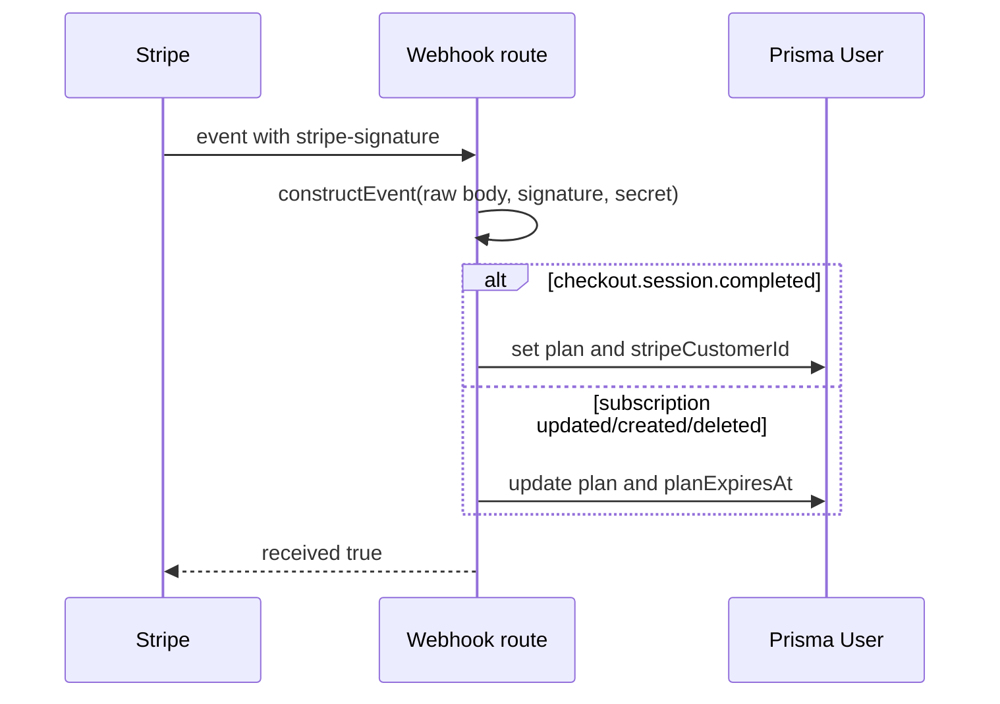

# Stripe Webhook Process

## Цель

Stripe webhook обновляет subscription state в Prisma `User`. Это источник истины для платного плана.

## Участники

- Stripe.
- `/api/stripe/webhook`.
- Prisma `User`.
- `User.plan`, `User.planExpiresAt`, `User.stripeCustomerId`.

## Flow

## Обрабатываемые events

- `checkout.session.completed`
- `customer.subscription.created`
- `customer.subscription.updated`
- `customer.subscription.deleted`

## Данные чтения

- raw request body;
- `stripe-signature`;
- `STRIPE_WEBHOOK_SECRET`;
- metadata `userId`, `plan`.

## Данные записи

- `User.plan`;
- `User.planExpiresAt`;
- `User.stripeCustomerId`.

## Файлы реализации

- `src/app/api/stripe/webhook/route.ts`
- `src/lib/billing.ts`

## Edge cases

- Invalid webhook signature.
- Missing metadata.
- Subscription canceled/unpaid.
- Stripe API version changes period fields.

## Улучшения

- Добавить `Subscription` table для истории.
- Логировать webhook events.
- Добавить idempotency по Stripe event id.
- Сохранять status: active, trialing, past_due, canceled.

