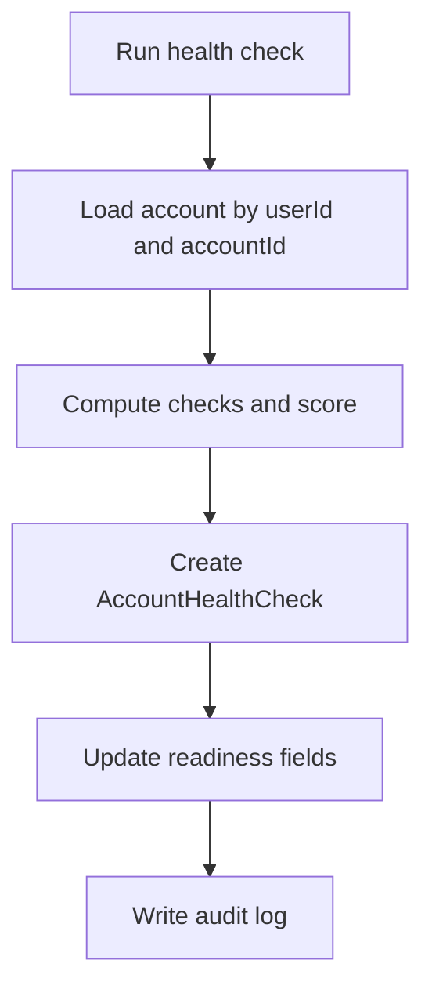

# Health Check Process

## Цель

Health check оценивает готовность рекламного кабинета к запуску.

## Участники

- Desktop health UI.
- Go health service.
- SQLite `AccountHealthCheck`, `MetaAdAccount`.
- Web helper `calculateAccountHealth`.

## Desktop scoring

Desktop health service считает 100-point score:

- token: 30 points;
- account status: 30 points;
- billing: 20 points;
- spend limit: 10 points;
- sync freshness: 10 points.

Status mapping:

- `READY` >= 75;
- `NEEDS_ATTENTION` >= 40;
- `BLOCKED` < 40.

## Web scoring

Web scoring subtracts penalties from 100:

- expired token;
- disabled/limited account;
- billing issue;
- no spend limit;
- stale sync.

Status mapping:

- `READY` >= 80;
- `NEEDS_ATTENTION` >= 50;
- `BLOCKED` < 50.

## Flow

## Файлы реализации

- `adops-desktop/internal/health/health.go`
- `adops-desktop/app.go`
- `src/lib/account-health.ts`
- `src/app/api/accounts/bulk-health-check/route.ts`

## Data writes

- `AccountHealthCheck`.
- `MetaAdAccount.readinessScore`.
- `MetaAdAccount.readinessStatus`.
- `MetaAdAccount.lastHealthCheckAt`.

## Edge cases

- Different scoring logic in web and desktop.
- Running check for archived account.
- Missing lastSyncAt.
- Token mock should not block MVP.

## Улучшения

- Consolidate scoring rules into shared spec.
- Add detailed check explanations in UI.
- Add real Meta status checks.
- Add scheduled checks.

