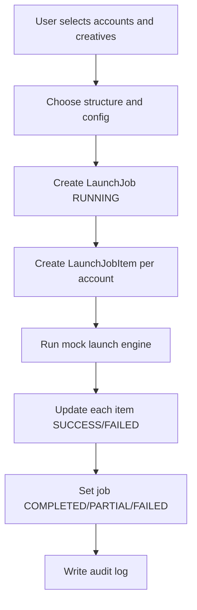

# Launch Job Process

## Цель

Создать массовый launch job по выбранным accounts, creatives, template/config, structure и optional headline set.

## Участники

- Desktop launch UI.
- Go launch service.
- SQLite launch tables.
- Web mock launch engine equivalent.

## Flow

## Structures

### CBO

One campaign per account, ad set/ad per creative.

### ABO

One campaign and one ad set per account, ads per creative.

### ISOLATION

One campaign/adset/ad chain per creative.

### Z_GROUPED

Groups creatives by `zGroup`; creates ad sets per Z group and can create multiple campaigns per account.

## Data writes

- `LaunchJob`
- `LaunchJobItem`
- `resultJson`
- counts:
  - `totalAccounts`
  - `successCount`
  - `failedCount`

## Файлы реализации

- `adops-desktop/app.go`
- `adops-desktop/internal/launch/engine.go`
- `adops-desktop/frontend/src/pages/launch/LaunchClient.tsx`
- `src/app/api/launch-jobs/route.ts`
- `src/lib/launch-engine.ts`

## Mock behavior

Each item has about 85% success chance and 15% failure chance. Failures simulate Meta API errors.

## Edge cases

- Selected account is archived.
- Selected creative missing.
- No headline for Z group.
- Random mock failure makes demo nondeterministic.
- Desktop and web launch engines may drift.

## Улучшения

- Seeded deterministic mock mode for demos.
- Real Meta API adapter.
- Async queue instead of synchronous run.
- Per-plan launch limits.
- Retry failed items.

