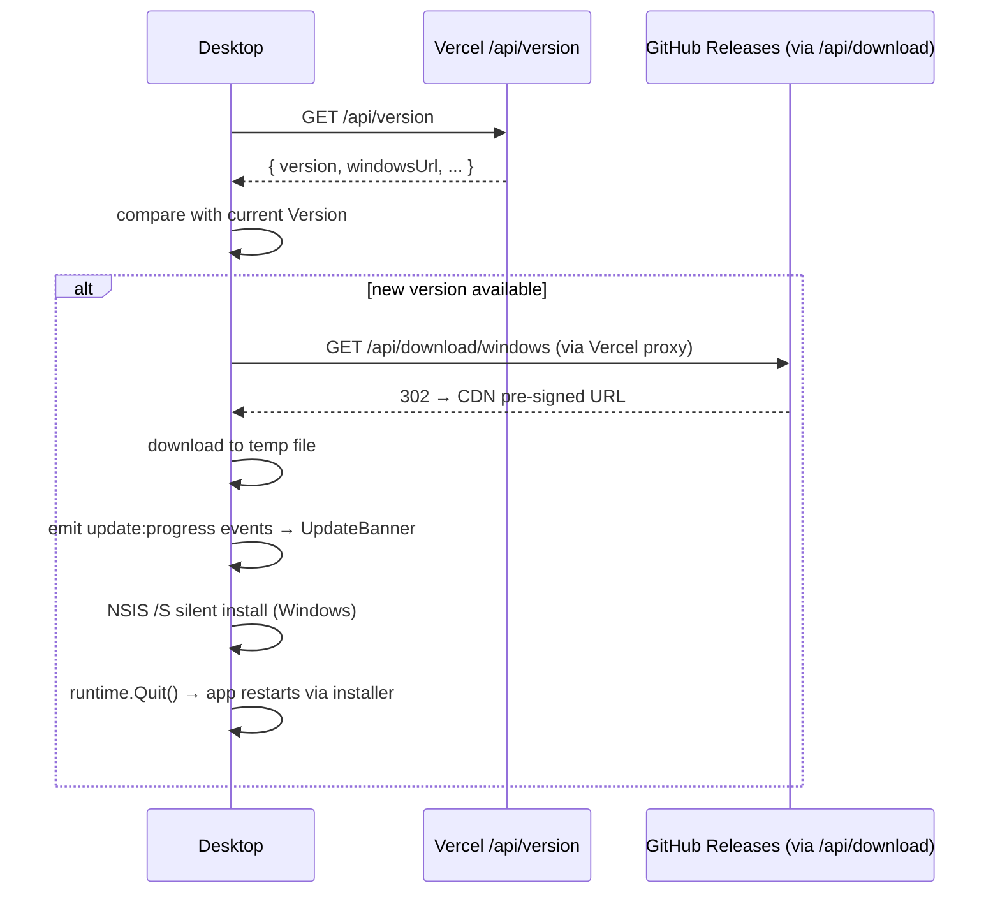

# Release and Verification Process

## Цель

Перед передачей сборки или деплоем убедиться, что web и desktop совместимы. Задокументировать как делается релиз desktop-приложения с auto-update.

## Desktop release (GitHub Actions)

Релиз desktop-приложения делается через git tag:

```powershell
git tag v1.0.X
git push origin v1.0.X
```

GitHub Actions workflow (`build.yml`) при обнаружении тега:
1. Собирает `AdOpsCockpit-windows-installer.exe` (NSIS installer).
2. Собирает `AdOpsCockpit-macos-arm64.dmg` и `AdOpsCockpit-macos-intel.dmg`.
3. Создаёт GitHub Release и загружает ассеты.
4. Вызывает Vercel deploy hook → обновляет `LATEST_APP_VERSION` в env.

После деплоя Vercel: `GET /api/version` начнёт отдавать новую версию, и запущенные desktop-приложения обнаружат обновление при следующем старте.

## Auto-update flow



## Checklist

### Web

```powershell
npm run build
```

Проверить:

- `/login` (email+pw и OAuth кнопки);
- `/register`;
- `/pricing`;
- `/desktop-callback`;
- `/api/session/verify`;
- `/api/version`;
- `/api/download/windows`;
- Stripe routes compile.

### Desktop frontend

```powershell
cd adops-desktop/frontend
npm run build
```

### Go

```powershell
cd adops-desktop
go test ./...
```

### Wails

```powershell
cd adops-desktop
wails build
```

## Manual auth verification

1. Start web with `npm run dev`.
2. Start desktop.
3. Click browser login.
4. Login через email+password.
5. Confirm web callback shows account and plan.
6. Confirm desktop enters main app.
7. Confirm `session.json` exists.

### OAuth verification

1. Click "Войти через Google".
2. Confirm Google account picker shown (не auto-login).
3. Select account.
4. Confirm browser остался на `/desktop-callback` (не перешёл на localhost).
5. Confirm desktop авторизовался.

## Manual auto-update verification

1. Собрать desktop с текущей версией `Version = "v1.0.X"`.
2. Деплоить `v1.0.X+1` через git tag.
3. Запустить старую сборку.
4. Должен появиться `UpdateBanner` с прогрессом.
5. Приложение должно само перезапустить себя.

## Regression risks

- Wails generated bindings out of sync — добавить методы в `App.js` и `App.d.ts` вручную после `wails build`.
- Chrome PNA blocking iframe to localhost — Go server должен отвечать на OPTIONS с `Access-Control-Allow-Private-Network: true`.
- `GITHUB_RELEASES_TOKEN` не добавлен в Vercel → download proxy вернёт 500.
- `LATEST_APP_VERSION` не обновился после деплоя → auto-update не обнаружит новую версию.
- Supabase Redirect URL allowlist не содержит `*` wildcard → OAuth redirect fallback идёт на Site URL.
- Next dev/build `.next` conflict.
- Stripe API type changes.

## Release notes template

```md
## Changed
- 

## Verified
- npm run build
- desktop frontend build
- go test ./...
- wails build
- manual auth (email+pw)
- manual auth (OAuth Google)
- desktop-callback iframe delivery
- auto-update banner

## Known risks
- 
```
