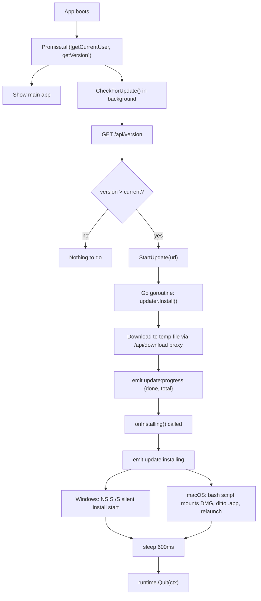

# Auto-Update Process

## Цель

При запуске desktop-приложения автоматически обнаружить новую версию, скачать её в фоне, установить тихо и перезапустить приложение без участия пользователя.

## Участники

- Desktop (`app.go`, `internal/updater/`).
- Vercel web (`/api/version`, `/api/download/[platform]`).
- GitHub Releases (private repo).
- React frontend (`App.tsx`, `UpdateBanner`).

## Триггер

Запуск desktop-приложения → `boot()` в `App.tsx`.

## Flow



## Download proxy flow

Desktop запрашивает `/api/download/[platform]` (публичный Vercel endpoint):

1. Vercel использует `GITHUB_RELEASES_TOKEN` для запроса к GitHub Assets API.
2. GitHub отвечает 302 на pre-signed CDN URL (временный, ~1 час).
3. Vercel возвращает этот 302 desktop.
4. Desktop следует redirect, качает файл напрямую с GitHub CDN.

Это нужно потому что GitHub Assets в private repo требуют Bearer token, которого у desktop нет.

## Данные чтения

- `LATEST_APP_VERSION` env var (Vercel).
- `GITHUB_RELEASES_TOKEN` env var (Vercel).
- Текущая `Version` в Go binary (встроена при сборке через ldflags).

## Данные записи

- Временный файл в `os.TempDir()`.
- (Windows) NSIS installer записывает поверх существующей установки.
- (macOS) `ditto` копирует .app в `/Applications`.

## Frontend UpdateBanner

`App.tsx` слушает Wails события:

```
update:progress  → { done: int64, total: int64 } → прогресс-бар
update:installing → фаза "Устанавливаем…"
update:error     → показать ошибку
```

Анимации в `globals.css`: `@keyframes shimmer` (фоновый блеск), `@keyframes indeterminate` (прогресс-бар без known total).

## Файлы реализации

- `adops-desktop/app.go` — методы `CheckForUpdate()`, `StartUpdate(url)`, `GetVersion()`
- `adops-desktop/internal/updater/updater.go` — `Check()` — fetch `/api/version`, compare
- `adops-desktop/internal/updater/install.go` — `Install()` — download + platform installer
- `adops-desktop/frontend/src/App.tsx` — `UpdateBanner`, EventsOn listeners
- `adops-desktop/frontend/src/globals.css` — shimmer/indeterminate animations
- `adops-desktop/frontend/wailsjs/go/main/App.js` — JS bindings (вручную до wails build)
- `adops-desktop/frontend/wailsjs/go/main/App.d.ts` — TypeScript types
- `src/app/api/version/route.ts` — version manifest
- `src/app/api/download/[platform]/route.ts` — download proxy

## Edge cases

- `GITHUB_RELEASES_TOKEN` не задан → `/api/download` вернёт 500.
- `LATEST_APP_VERSION` не обновился → desktop не видит новую версию.
- Wails bindings (`App.js`/`App.d.ts`) не обновлены → runtime error.
- Go `runtime` import конфликт с `wailsruntime` → используй alias `goruntime "runtime"`.
- macOS: приложение запущено из `/Applications`, но `.app` не там → ditto скопирует не туда.
- Windows: NSIS installer не найден или не запустился → `updater.Install` вернёт error.

## Проверка

1. Собрать desktop с `Version = "v1.0.X"`.
2. Деплоить `v1.0.X+1` через git tag → GitHub Actions → Vercel.
3. Запустить старую сборку.
4. Через несколько секунд появится `UpdateBanner`.
5. Прогресс заполняется → фаза "Устанавливаем" → приложение закрывается и перезапускается.
