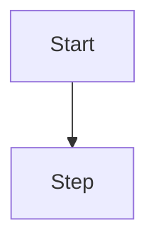

# Process Name

## Цель

Кратко описать, какую пользовательскую или системную задачу закрывает процесс.

## Участники

- UI/page.
- API/handler/service.
- Database/model.
- External service, если есть.

## Триггер

Что запускает процесс.

## Flow

## Данные чтения

- 

## Данные записи

- 

## Файлы реализации

- 

## Edge cases

- 

## Verification

- 

## Улучшения

- 

